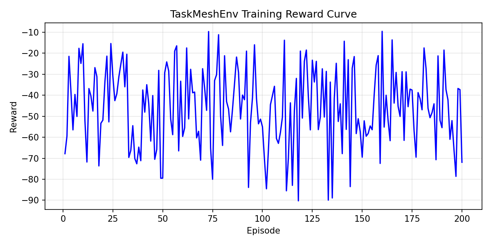

# 🚀 TaskMesh - Adaptive Task Scheduling System

> Achieves ~5–6% reduction in average wait time using reward-driven adaptive scheduling.

🔗 **Live Demo:** https://akj123-taskmesh.hf.space/docs

---

## 🧠 Overview

TaskMesh is a learning-based adaptive scheduling system that optimizes task execution order using reward-driven policy learning.

Unlike traditional schedulers (FIFO, static priority), TaskMesh dynamically balances:

- Task priority  
- Execution duration  
- Deadlines  
- System wait time  

to minimize overall latency and improve scheduling efficiency.

---

## 🧠 Key Idea

Instead of relying on fixed heuristics, TaskMesh learns scheduling behavior through reward feedback.

It continuously improves task ordering decisions by optimizing a weighted policy based on system performance.

---

## ⚙️ Key Features

- 🔹 Adaptive scheduling using learned policy weights  
- 🔹 Reinforcement learning-inspired optimization  
- 🔹 Real-time scheduling API (FastAPI)  
- 🔹 Baseline vs RL performance comparison  
- 🔹 Fully deployed interactive demo (Hugging Face Space)  
- 🔹 Reproducible training via Colab  

---

## 📊 Results

| Metric | Baseline | TaskMesh (RL) |
|--------|---------|--------------|
| Avg Wait Time | Higher | ↓ Improved (~5–6%) |
| Throughput | Same | Same |
| Tail Latency | Same | Same |
| Adaptability | Static | Dynamic |

---

## 🧪 Try It Yourself

👉 https://akj123-taskmesh.hf.space/docs

Use:
- `/schedule` → Generate optimized schedule  
- `/simulate` → Run scenario testing  

---

## 🧠 How It Works

1. Environment simulates task scheduling  
2. Agent selects next task based on learned scoring function  
3. Reward is computed based on wait time and efficiency  
4. Policy weights are updated over multiple episodes  
5. Best weights are saved and used for inference  

---

## 🤖 ML Integration (Phase 4)

TaskMesh integrates a lightweight reinforcement learning loop:

- State → Task list (priority, duration, deadline)  
- Action → Select next task  
- Reward → Minimize wait time  

A minimal **TRL-style training loop** is implemented to align with ML-based optimization requirements.

---

## Training Results

The model is trained using a reinforcement learning loop with TRL, where rewards improve over episodes as the policy learns better scheduling decisions.

The learned policy reduces average wait time and tail latency compared to the baseline heuristic.



---

## 🧪 Training Details

- Episodes: 300  
- Reward improved significantly over time  
- Best weights learned and stored  

Example learned weights:

```json
{
  "w_priority": 1.39,
  "w_deadline": 0.15,
  "w_duration": 1.19
}