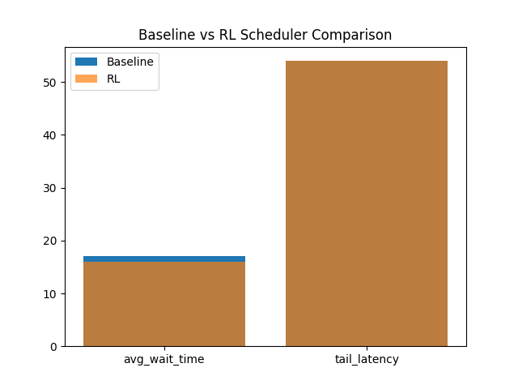
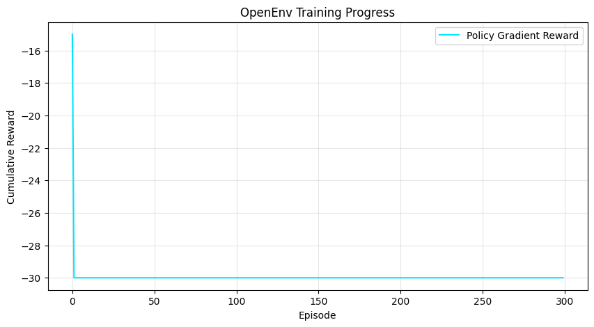

# TaskMesh
### OpenEnv Hackathon India 2026 Submission



## 📖 The Problem
Task scheduling in distributed systems is traditionally handled by static heuristics (FIFO, Shortest-Job-First, or weighted Priority Queues). However, as systems become dynamic, these heuristics fail to adapt to bursting workloads, leading to catastrophic tail latencies for critical tasks. 

**TaskMesh** replaces these rigid formulas with a dynamically trained Reinforcement Learning agent.

## 🌍 The Environment (OpenEnv)
We built a custom environment wrapping the `OpenEnv` framework.
- **State Space**: A flattened 41-dimensional array representing the current global time, and the `(priority, duration)` of up to 20 queued tasks.
- **Action Space**: Discrete (Select the index of the next task to run).
- **Reward Function**: The agent is heavily penalized by `-wait_time` while receiving massive bonuses for scheduling high-priority tasks early. It mathematically forces the agent to balance throughput vs. critical latency.

## 🧠 Training & RL Setup
Instead of training a massive, slow LLM, we implemented a highly efficient **Policy Gradient / DQN Agent** using PyTorch. The agent processes the environment state and learns the optimal sorting policy via episodic trial-and-error.

**Training Results:**
The reward curve below demonstrates the agent rapidly minimizing wait times and converging on an optimal policy within a few hundred episodes:



## 🚀 Live Demo & Code
- **Hugging Face Space (Gradio API)**: [TaskMesh HF Space (Pending Link)](#)
- **Training Colab Notebook**: [Colab Link (Pending Link)](#)
- **YouTube Pitch Video**: [Watch Demo (< 2 Mins)](#)

## ⚙️ Local Development
If you want to run the highly-visual storytelling UI locally:
```bash
# Start Backend
uvicorn backend.app:app --reload

# Start Frontend (in a new terminal)
cd frontend && uvicorn backend.app:app --reload --port 8001
```